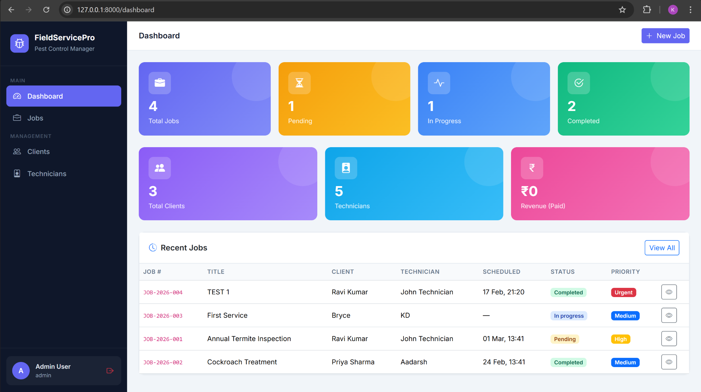

# 🚀 Field Service Management System (FSM)

A professional Field Service Management (FSM) web application built using Laravel 12 and PHP 8.

This system digitizes the complete lifecycle of service operations — from job creation and technician assignment to resource tracking and automated invoice generation.

---

## 📸 Application Screenshots

### 1️⃣ Admin Dashboard
Displays priority-based job listing with intelligent sorting.


---

### 2️⃣ Job Details & Resource Logging
Track service charges, chemicals, equipment, and upload before/after evidence.


---

### 3️⃣ Geo-Tagged Map View
Interactive job location tracking using Leaflet.js and OpenStreetMap.


---

### 4️⃣ Generated PDF Invoice
Automatically calculated totals with professional PDF formatting.


---

## 🌟 Project Overview

The FSM application streamlines field operations by providing:

- Client & Job Management
- Smart Job Numbering (JOB-YYYY-XXX format)
- Technician Assignment & Role Control
- Resource & Service Charge Tracking
- Before/After Evidence Uploads
- Priority-Based Dashboard Sorting
- Geo-Tagged Job Locations (Leaflet + OpenStreetMap)
- Automated PDF Invoice Generation
- Invoice Sync Warning System
- Role-Based Access Control (Admin / Technician)

---

## 🏗️ Technical Stack

### Backend
- Laravel 12
- PHP 8.4+
- Eloquent ORM
- Laravel Breeze (Authentication)
- Spatie Laravel Permission (RBAC)

### Frontend
- Blade Templating Engine
- Bootstrap 5
- Vite
- Leaflet.js (Maps)

### Database
- SQLite (Development)
- Easily portable to MySQL / PostgreSQL

### Media & Documents
- Laravel Filesystem (Local Storage)
- DomPDF (Invoice PDF generation)

---

## 🔐 Role-Based Access Control (RBAC)

### Admin
- Full access to Clients, Jobs, Technicians
- Create / Update Invoices
- Manage service charges & resources
- View system-wide dashboard

### Technician
- View assigned jobs only
- Update job status
- Upload before/after images
- Log service charges & resources

Access is enforced using middleware, role checks, and permission-based authorization.

---

## 🔢 Smart Job Numbering

Each job is automatically assigned a sequential ID:

```
JOB-2026-001
JOB-2026-002
```

The numbering:
- Resets each year
- Is generated automatically during job creation
- Uses a Laravel Model Observer

---

## 📊 Intelligent Dashboard Sorting

Jobs are dynamically sorted based on business priority:

1. Active jobs (Pending / In Progress first)
2. Urgency level (Urgent > High > Medium > Low)
3. Scheduled date
4. Completed / Cancelled jobs moved to bottom

This ensures high-visibility for urgent tasks.

---

## 💰 Dynamic Invoicing System

- Invoice totals are calculated from logged service charges
- Snapshot-based sync detection system
- Alerts when job costs change after invoice generation
- Allows regeneration of invoices
- Professionally formatted PDF output using DomPDF

---

## ⚡ Performance Optimization

- Eager Loading to prevent N+1 query issues
- Relational database schema
- Clean MVC architecture
- Scalable for large datasets

---

## 🗺️ Geo-Tagging Integration

Integrated Leaflet.js with OpenStreetMap to:

- Display job locations interactively
- Avoid API billing costs
- Provide map support without API keys

---

## 🛠️ Installation Guide

Clone the repository:

```bash
git clone https://github.com/kuldeeps0904-spec/fsm-laravel.git
cd fsm-laravel
```

Install dependencies:

```bash
composer install
```

Setup environment:

```bash
cp .env.example .env
php artisan key:generate
```

Run migrations:

```bash
php artisan migrate
```

Start the development server:

```bash
php artisan serve
```

Visit:

```
http://127.0.0.1:8000
```

------

## 🔑 Demo Login Credentials

For testing and demonstration purposes, use the following default accounts:

### 👨‍💼 Admin Account
- **Email:** admin@fsm.com  
- **Password:** password  

### 👷 Technician Account
- **Email:** tech@fsm.com  
- **Password:** password  

> ⚠️ Note: These credentials are for development/demo use only.  
> It is strongly recommended to change default passwords in production environments.

---


## 📌 Future Improvements

- Queue-based invoice generation
- Cloud storage integration (AWS S3)
- API layer for mobile app integration
- Real-time technician tracking
- Analytics dashboard
- Concurrency-safe job numbering

---

## 👨‍💻 Author

Kuldeep Shrivastav  

Full-Stack Developer (Laravel | Flutter)

---

## 📄 License

This project is for educational and demonstration purposes.
The Laravel framework is open-sourced software licensed under the [MIT license](https://opensource.org/licenses/MIT).
